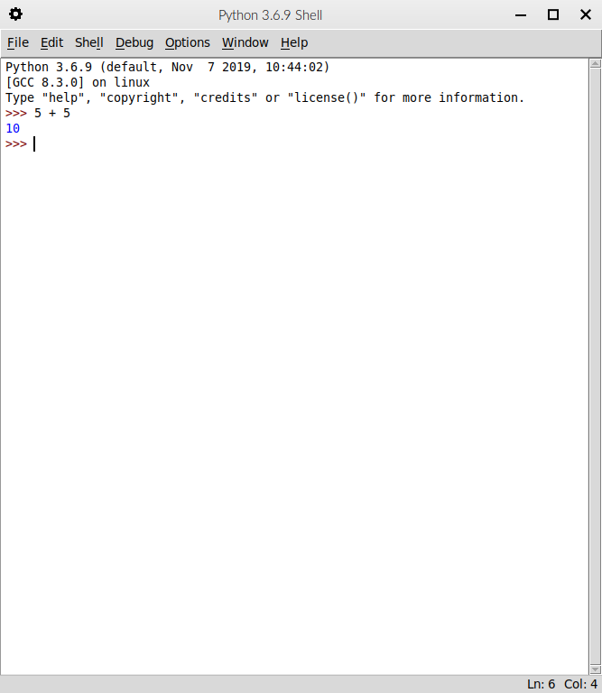

# Prostředí IDLE

#### Co je to IDLE

Prostředí IDLE (Integrated Development and Learning Environment)
slouží zejména ke zkoušení a hraní si s jazykem Python. Prostředí
nám umožňuje psát kód řádek po řádku a tlačítkem `Enter` jej
okamžitě spustit.

#### Instalace IDLE

Prostředí IDLE je přibalené k programovacímu jazyku
Python a při instalaci pomocí instalačního souboru staženého
z oficiálních stránek jazyka Python se nám na počítač nainstaluje
automaticky. Pokud používáme operační systém Linux, je třeba jej
doinstalovat pomocí příkazu

```bash
sudo apt install idle
```

#### Spuštění IDLE

Prostředí IDLE lze spustit kliknutím na ikonku nebo z terminálu
pomocí příkazu

`idle`

#### Prostředí IDLE

Po spuštění IDLE se nám zobrazí okno, do kterého můžeme psát kód
v jazyce Python. Kód se okamžitě provede a výsledek se nám vypíše.

Prostředí IDLE většinou nepoužíváme k programování. Je využíváno
spíše k výuce nebo při testování. My jej budeme používat hlavně
díky jeho automatickému vypisování výsledku, ať se vyhneme
zbytečnému manuálnímu výpisu. Později samozřejmě přejdeme k jiným
prostředím.



---

<div style="text-align: left"  > <a href="programming_languages.md">Předchozí kapitola </a> </div>
<div style="text-align: center"> <a href="../README.md">Zpět                           </a> </div>
<div style="text-align: right" > <a href="basic_math.md">Následující kapitola          </a> </div>
