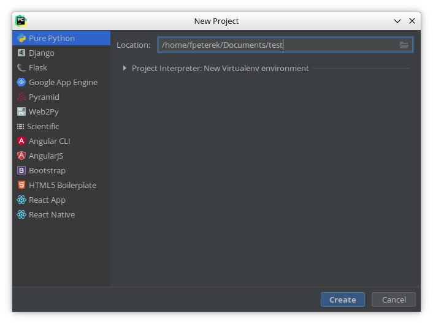
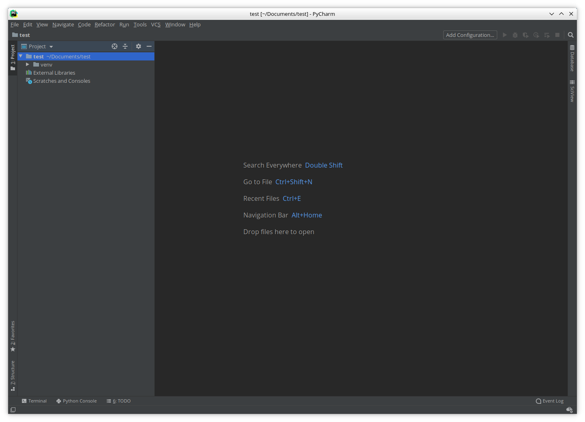

# Spouštění programů z terminálu, IDE

V příští kapitole již trochu naroste složitost kódu a prostředí IDLE přestane
být vhodné. Z tohoto důvodu přejdeme k jinému prostředí, IDE Pycharm.

#### Co je to IDE

IDE (Integrated Development Environment) je prostředí vytvořené za účelem psaní
a debugování kódu. Nabízí zvýrazňování syntaxe, našeptávač kódu, nástroje pro
spouštění, testování a debugování programu a spoustu dalších funkcí. My
využijeme IDE PyCharm. Prostředí PyCharm nabízí kromě verzi placenou i
neplacenou. Placená verze je ovšem poskytována studentům zdarma. Prostředí
PyCharm [lze stáhnout zde](https://www.jetbrains.com/pycharm/download/).


Místo IDE můžeme také využít jakýkoliv textový editor, přednostně pak editor,
který podporuje zvýrazňování syntaxe (anglicky 'syntax highlighting') pro jazyk
Python.

## Vývojové prostředí PyCharm

Vývojové prostředí PyCharm je dnes považováno v podstatě za standard mezi
vývojáři používajícími Python. Díky své spoustě funkcí se ovšem může na první
pohled zdát komplikovanější, než ve skutečnosti je. Proto si ukážeme, jak lze
ve vývojovém prostředí PyCharm vytvořit projekt a napsat a následně spustit
jednoduchý zdrojový kód.

#### Spuštění PyCharmu a vytvoření projektu

Docela ironicky se situace zkomplikuje již při spuštění PyCharmu. Po spuštění
může totiž dojít ke dvěma odlišným věcem. Může dojít k zobrazení okna sloužícímu
k výběru projektu, nebo přímo k otevření projektu již existujícího. Toto chování
závisí na nastavení a předchozím užívání prostředí PyCharm. Po prvním spuštění
je navíc třeba PyCharm nakonfigurovat. V takovém případě je méně zkušeným
programátorům doporučováno ponechání původního nastavení, s výjimkou barevného
motivu, který si může každý nastavit dle svých preferencí. Také je silně
doporučováno **neaktivovat** Vim plugin bez předchozích zkušeností s editorem
Vim (budete mi muset věřit, bez předchozí zkušenosti s tímto textovým editorem
vám tento plugin velmi ztíží práci se zabudovaným editorem v prostředí PyCharm).

Pokud se otevře uvítací okno s výběrem projektu, můžeme založit nový projekt,
anebo otevřít projekt starší. Jen pozor, ať neotevřeme cizí projekt!


Uvítací okno

Projekt založíme kliknutím na tlačítko `Create New Project`. Vybereme čistý
Python bez jakýchkoliv frameworků, zadáme adresu a název projektu a vytvoříme
projekt.



Vytvoření projektu

Po vytvoření projektu PyCharm zobrazí okno s projektem.



Otevřený projekt

Také se může stát, že PyCharm zobrazí již předem vytvořený projekt. V takovém
případě lze vytvořit nový projekt klepnutím na `File->New->Project` v levém
horním rohu.

Jakmile máme projekt vytvořený, můžeme vytvořit zdrojové soubory a začít
s vývojem programu. Soubory lze vytvořit přímo ve složce s projektem, nebo lze
vytvořit podsložku. U jednodušších projektů na tomto rozhodnutí příliš nezáleží
u větších a složitějších projektů je lepší začít vytvořením podsložky. Nový
soubor v PyCharmu vytvoříme pravým klepnutím na složku, kde chceme soubor
umístit a následným kliknutím na `New->File`. Zadáme jméno souboru a stiskem
klávesy `enter` soubor vytvoříme. Při vytváření souboru bychom se měli ujistit,
že má soubor příponu `.py`. Následně již můžeme do souboru zapisovat kód
v jazyce Python.


Program Hello, World! v prostředí PyCharm.

Program spustíme klepnutím na `Run->Run...` a výběrem souboru, který chceme
spustit. PyCharm poté vybraný soubor udržuje v paměti, a dokud budeme chtít
spustit stejný soubor, jako při předchozím spuštění, stačí kliknout na zelené
tlačítko `Run`.

## Spouštění programů z terminálu

Programy napsané v jazyce Python lze také spouštět z terminálu (v Linuxu,
mac OS) nebo z příkazové řádky (Windows). Příkaz pro spuštění programu je
naštěstí stejný ve všech třech operačních systémech.

```Bash
python3 /path/to/file.py
```

Nejjednodušší řešení samozřejmě je přesunout se do složky se zdrojovými kódy
za pomocí příkazu `cd`. Poté je totiž stačí jako cestu k souboru zadat pouze
název daného souboru.

Za využití následujících příkazů můžeme na ploše vytvořit složku test,
ve které vytvoříme soubor main.py, do kterého následně můžeme psát zdrojový
kód a poté jej i spustit. Příkazy fungují pouze v operačních systémech Linux
a mac OS.

```Bash
cd Desktop/     # Přesun do složky Desktop (na systémech v češtině je třeba napsat 'Plocha' místo 'Desktop')
mkdir test      # Vytvoření nové složky test
cd test         # Přesun do složky test
touch main.py   # Vytvoření soubory main.py

# Následující příkaz je nepovinný. Místo něj můžeme soubor upravit v libovolném
# textovém editoru.
echo 'print("Hello, World!")' > main.py # Zapsání programu 'Hello, World!' do souboru


python3 main.py # Spuštění souboru main.py
```

Vše lze samozřejmě provést také v grafickém rozhraní, nemusíme nutně používat
terminál. Spousta programátorů ale po nějaké době začne preferovat textové
rozhraní terminálu, jelikož jim přijde rychlejší a příjemnější na použití
(opravdu, věřte mi).

---

<div style="text-align: left"  > <a href="collections.md">Předchozí kapitola  </a> </div>
<div style="text-align: center"> <a href="../README.md">Zpět                  </a> </div>
<div style="text-align: right" > <a href="constructs.md">Následující kapitola </a> </div>
